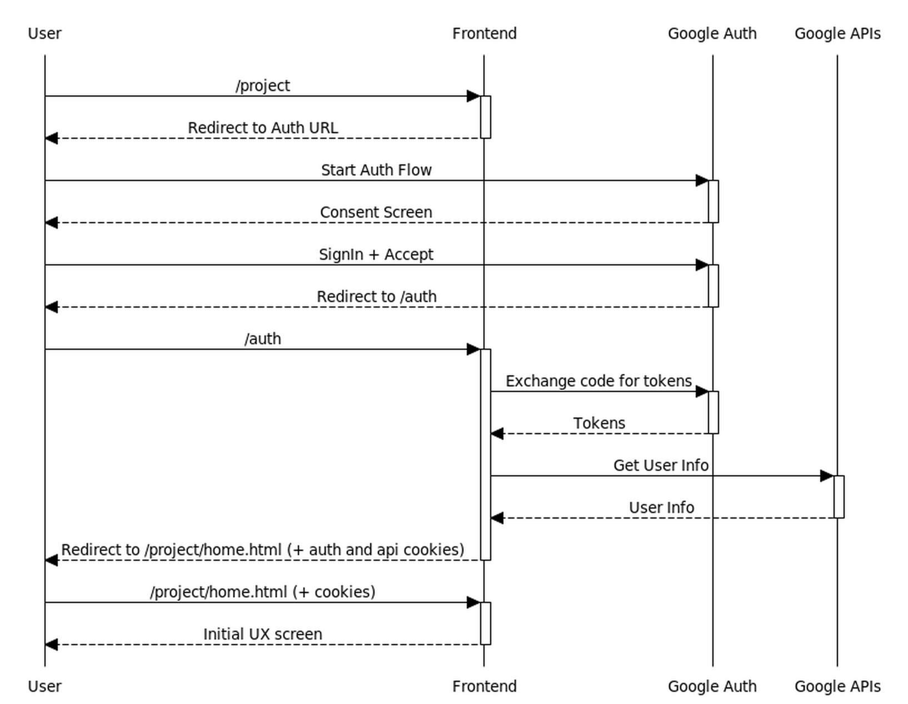

# Description for proto-api-frontend Project

This is a prototype of a UX frontend server that provides UX and authN/authZ functionality, and static content hosting, while the dynamic content and APIs are served by an API server (to authenticated users). The frontend server is a shared resource, i.e. it might work with many API servers distributed across different projects.

Both servers are implemented in node.js, for purposes of the prototyping, and authentication is performed via OAuth using Google APIs.

The goals/constraints are:

- The user is always browsing to the frontend server, i.e. the URL shown in the browser's addressbar always refers to the frontend server.
- The user only signs in once, i.e. when browsing to the frontend server.
- The pages can make API requests directly to the API server, without needing an intermediate proxy, so as to avoid latency, load of long-lived connections on the shared frontend server, and bandwidth consumption by the frontend.

Nice-to-have goals:

- The frontend does not see any private user-owned data because it flows directly from the browser to the API server that is owned by the user.
- All credentials (OAuth tokens) are only stored in the backend (never transmitted to the client), and additionally, only stored within the API server project, and never on the shared frontend project.

## Initial Request

This represents the request/response flow for the initial set of requests to authenticate the user, between the browser and the frontend server.

Two cookies result from this interaction:

- An http-only auth cookie containing the project name and authenticated user id. This is encrypted using a private secret.
- An api auth cookie containing the same data. This is accessible via script on the client, and it is encrypted using a shared secret (shared between frontend and api servers)

## Additional Requests

Once signed in, the user can navigate through static content served by the frontend server, dynamic content served by the API server, while the pages loaded into the browser can make API requests back to the API server directly.

In order to facilitate cross-domain requests, the API server implements the CORS protocol to indicate it trusts the frontend.

## Additional Auth Details

Two important steps were not covered in the sequence diagrams above, and they haven't been implemented on the prototype yet, namely authorization, and instantiating the API server on behalf of the user.

Here is a more detailed flow that introduces this on the frontend side of things.

This adds the following details

- A record of a shared secret per project within the db associated with the frontend server. This shared secret is created dynamically as a random uuid.
- The storage of the resulting OAuth tokens within the db associated with the API server keyed by the userid.
- Spinning up of a VM representing the API server with the user project (using the tokens resulting from the OAuth flow)
- Sharing of the shared secret with the API server by way of metadata settable on the VM running the API server.

## Authentication/Authorization with the API Server

The API server doesn't do its own authentication. It simply checks for an Authorization header on all incoming requests.

It decodes those headers using the shared secret it was assigned when the VM hosting this server was created by the frontend. This ensures a first check of validity - that the authorization header was produced by the frontend, and meant to be consumed on the particular VM.

The API server uses the userid in the authorization header, its known VM name (something it knows, rather than coming externally), and looks up its db for OAuth tokens when making requests on behalf of the user. These were stored by the frontend server.

## Running the Prototype

**Step 1** - Create a Google Cloud Project (if needed). This will be used to create a registered OAuth client - specifically a web-based OAuth client. You'll also need to configure its OAuth Consent Screen properties.

**Step 2** - Download the JSON description of your OAuth client registration and name it secrets.json within the frontend directory.

**Step 3** - Start the API Server (since in this prototype, the frontend does not spin up API servers). In a terminal prompt:

    source setup.sh
    node api/main.js

**Step 4** - Start the Frontend Server (in another terminal prompt)

    source setup.sh
    node frontend/main.js
    
**Step 5** - Browse to the Frontend (assuming no ports were changed in setup.sh)

    http://127.0.0.1:6908/[selected project name]

